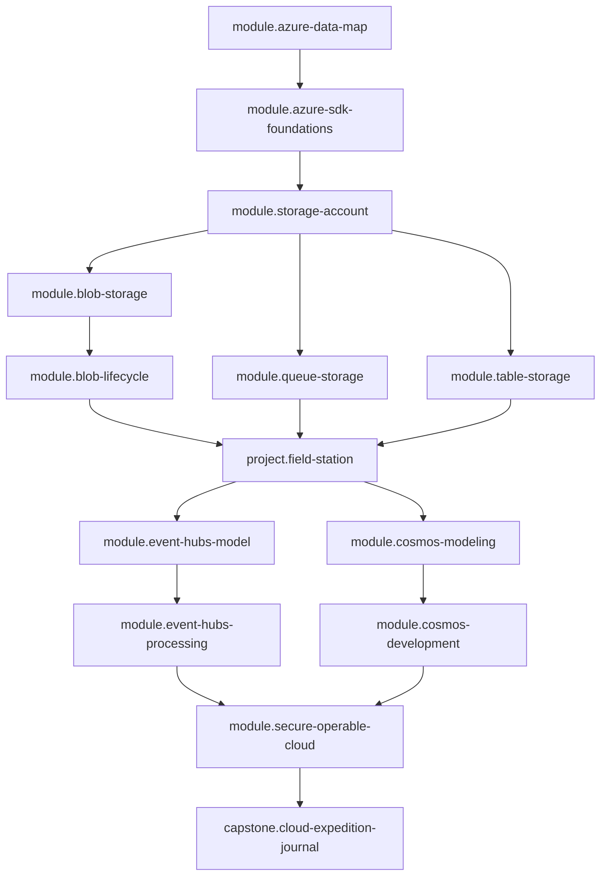

# 🗺️ Curriculum design

This document is the human-readable half of the curriculum authority. The
machine-readable half is [`curriculum.json`](curriculum.json), validated by
[`tools/CourseVerifier`](../../tools/CourseVerifier) against the contract in
[`curriculum-plan-schema.md`](curriculum-plan-schema.md). The rendered coverage
record is [`evidence-matrix.md`](evidence-matrix.md).

> **Status.** The graph, outcomes, evidence records, and conventions below are
> **final**. Modules 1 through 12 — from choosing a data primitive, through
> Storage, Event Hubs, and Cosmos DB for NoSQL, to securing and operating the
> live architecture — are **built**: each has a narrative, a runnable companion,
> a starter, a reference solution, and a shared evaluator, and modules 3 through
> 12 add paired Azure CLI and Azure PowerShell labs. `project.field-station` is
> **built** too — guide, starter, reference solution, and one shared evaluator
> across five milestones — so the `applied` evidence stage of modules 1 through
> 7 is `covered` by its starter tree rather than deferred.
> `capstone.cloud-expedition-journal` is **built** as well, across the same three
> trees and five milestones, so the `applied` stage of modules 8 through 12 is
> now `covered` by its starter tree too: nothing in the plan is deferred any
> more, and every unit of the curriculum is present. The
> verifier fails if content appears without the plan being updated, if the plan
> is promoted without the content, or if the Learning Mentor manifest registers
> a unit whose artifacts do not exist. Nothing here claims coverage the
> repository lacks.

## Design rules

1. **Semantic identity.** A unit is `module.<slug>`, `project.<slug>`, or
   `capstone.<slug>`. IDs never encode an ordinal, a directory name, or a commit.
   Renames change titles and paths; a material change of meaning creates a new ID.
2. **Prerequisites are claims, not decoration.** Each edge asserts that the unit
   depends on material the earlier unit teaches. Redundant edges are rejected by
   the verifier, so the graph stays transitively reduced and reviewable.
3. **Ordinals order presentation only.** The teaching sequence is a topological
   order of the graph, checked mechanically — never inferred from directory order.
4. **Outcomes are measurable.** Every outcome starts with an observable verb and
   names the evaluator that judges it. "Understand", "know", and "explore" are
   rejected by the verifier.
5. **Evidence is staged.** Every unit records
   named → explained → demonstrated → practiced → applied, and a stage may claim
   coverage only when the artifact exists on disk.

## Prerequisite graph



| seq | unit | prerequisites |
| --- | --- | --- |
| 1 | `module.azure-data-map` | none |
| 2 | `module.azure-sdk-foundations` | `module.azure-data-map` |
| 3 | `module.storage-account` | `module.azure-sdk-foundations` |
| 4 | `module.blob-storage` | `module.storage-account` |
| 5 | `module.blob-lifecycle` | `module.blob-storage` |
| 6 | `module.queue-storage` | `module.storage-account` |
| 7 | `module.table-storage` | `module.storage-account` |
| 8 | `project.field-station` | `module.blob-lifecycle`, `module.queue-storage`, `module.table-storage` |
| 9 | `module.event-hubs-model` | `project.field-station` |
| 10 | `module.event-hubs-processing` | `module.event-hubs-model` |
| 11 | `module.cosmos-modeling` | `project.field-station` |
| 12 | `module.cosmos-development` | `module.cosmos-modeling` |
| 13 | `module.secure-operable-cloud` | `module.event-hubs-processing`, `module.cosmos-development` |
| 14 | `capstone.cloud-expedition-journal` | `module.secure-operable-cloud` |

`module.queue-storage` and `module.table-storage` depend on
`module.storage-account`, not on `module.blob-storage`: they share the account
boundary, not blob mechanics. Presenting blobs first is a sequencing choice, not
a dependency, and the graph says so.

## Split decisions

- **Blob is two modules.** `module.blob-storage` teaches object mechanics —
  containers, streaming transfer, metadata, tags, listing.
  `module.blob-lifecycle` teaches precondition and retention semantics — ETag
  conditional writes, versioning, soft delete, tiering. Merging them would hide
  two different prerequisite boundaries behind one evaluator: one asserts
  transfer behavior, the other asserts concurrency behavior under a competing
  writer. The split also puts optimistic concurrency in front of the learner
  twice — once for blobs, once for table entities — before the project depends on
  it.
- **Event Hubs is two modules.** Producing a partitioned stream and consuming it
  with owned checkpoints are independently teachable models with independently
  verifiable practice: batching and key choice versus ownership, replay, and
  recovery.
- **Cosmos DB is two modules.** Modeling decisions (partition key, request units,
  consistency, indexing) are made before code exists; the development module then
  exercises the SDK against a model the learner already justified.
- **Storage account is its own module.** Blob, Queue, and Table share one account
  boundary. Teaching endpoints, redundancy, tiers, encryption, and the auth
  boundary once — with the first live checkpoint and the first mirrored
  CLI/PowerShell lab — keeps three later modules from each re-deriving it.

## Project and capstone placement

`project.field-station` sits at sequence 8, after every Storage module and before
Event Hubs and Cosmos DB. That placement is a contract requirement, not a
preference: the applied project must follow all of its prerequisites, and later
units genuinely treat its applied experience as assumed — `module.event-hubs-model`
contrasts streams with the queue pipeline the learner has already built, and
`module.cosmos-modeling` contrasts documents with the table index they already
designed.

`capstone.cloud-expedition-journal` is the single required final destination and
is taught last. It integrates every service and adds nothing untaught: telemetry
enters through Event Hubs, reports and checkpoints share a Blob container, work
travels on a Storage queue, station state and the per-station watermark live in
Table Storage, and the queryable journal is a Cosmos container partitioned on the
station. Its five milestones are the same architecture read in dependency order,
and its evaluator is offline, so the live checkpoint stays opt-in.

Both are staged into milestones with their own local, acyclic prerequisite order,
so partial progress is trackable and a learner is never asked to build the whole
system in one step.

## Repository role map

| contract role | fulfilled by | status |
| --- | --- | --- |
| learner entry point | `README.md` | present |
| setup and troubleshooting | `docs/SETUP.md` | present |
| sequenced instructional units | `lessons/<NN>-<slug>/` | present (modules 1-12) |
| practice, starter, and solution | `exercises/<NN>-<slug>/{starter,solution,tests}` | present (modules 1-12) |
| applied projects and capstones | `projects/field-station/`, `capstones/cloud-expedition-journal/` | present (`project.field-station`, `capstone.cloud-expedition-journal`) |
| reference and recall | `docs/CHEATSHEET.md` | planned |
| environment manifests | `compose.yaml`, `global.json`, `Directory.*.props` | present |
| automated validation | `tools/CourseVerifier/`, `.github/workflows/course.yml`, `docs/QUALITY.md` | present |
| Learning Mentor integration | `.agents/skills/azure-learning-path/`, `.learning-mentor.toml` | present |

## Starter, solution, and shared-evaluator convention

Every practice unit has exactly three trees, derived from its slug rather than
hand-declared:

```text
exercises/<NN>-<slug>/
  starter/     # learner-owned .NET project, complete enough to begin, with labeled gaps
  solution/    # reference implementation, never read before a genuine attempt
  tests/       # the single shared evaluator, referenced by both trees
```

Projects and capstones use the same three trees under `projects/<slug>/` and
`capstones/<slug>/`.

The rules that make this an evaluation *contract* rather than a folder habit:

1. **One authoritative evaluator.** `tests/` is the only judge. It is referenced
   by the starter and the solution through the same project reference and the
   same public contract, so starter and reference behavior cannot be graded by
   different code. `.NET` selects the implementation by **project path**, which
   is why the mentor manifest records `implementation_selector.kind =
   "project-path"` with `starter` and `solution` values.
2. **The starter must fail first, and say why.** Each unit declares
   `untouched_starter_result` in `course.toml`. `fails` is the default: the
   untouched starter fails at the first intended gap with an actionable message.
   A `passes` baseline is allowed only with a note stating that the pass is *not
   completion evidence* — the adapter rejects a passing baseline without it.
3. **The solution has a different bar.** It must satisfy the same evaluator, run
   as claimed, demonstrate the taught approach, and keep consequential decisions
   reviewable. A polished solution never excuses an unusable starter.
4. **Evaluators must reject plausible wrong answers.** Each shared evaluator
   carries adversarial fixtures for the failure modes its module teaches —
   duplicate delivery, stale ETags, cross-partition batches, unbounded retries,
   swallowed cancellation, checkpointing before handling, skipped cleanup.
   Reference success alone is never accepted as evidence of evaluator strength.
5. **Locks follow the solution, never the learner.** `course.toml` declares one
   lock group per unit covering only its `solution/` tree. Starters and
   narratives are never locked.

Live-service work is never part of an automated evaluator. Emulator-backed and
live checks are separately categorized, and continuous integration never creates
cloud resources.

## Validation design

| gate | what it protects |
| --- | --- |
| `CourseVerifier verify` | plan integrity, acyclicity, transitive reduction, measurable outcomes, evidence honesty, role map, manifest registration, matrix freshness |
| `course_adapter.py validate` | the mentor manifest: IDs, graph, paths, commands, selectors, locks |
| `dotnet build` / `dotnet test` | the code the course ships |
| `dotnet format --verify-no-changes` | one formatting authority |
| `.github/workflows/course.yml` | all of the above on every push and pull request |

The two authorities meet at one rule: **a unit may be registered in
`course.toml` only when the plan marks its artifacts `present`, and the plan may
mark them `present` only when they exist on disk.** That is what keeps the
mentor, the matrix, and the README from advertising a course that has not been
written.

## Unit records

The sections below restate each unit's promise. The outcome statements are
reproduced verbatim from `curriculum.json`; the verifier fails if they drift.

### `module.azure-data-map` — Choose the right Azure data primitive

Establish the mental model that separates durable objects, work messages, keyed entities, event streams, and queryable documents, and the naming and cleanup discipline every later unit depends on.

- **Prerequisites:** none
- **Environments:** local
- **Paired CLI and PowerShell labs:** no

Outcomes — the learner can:

- Choose the Azure data primitive that fits a stated expedition requirement and justify it against the adjacent service. *(`outcome.azure-data-map.select-primitive`, judged by `exercise_tests`)*
- Compare durability, ordering, partitioning, replay, and cost characteristics across blob, queue, table, event stream, and document storage. *(`outcome.azure-data-map.compare-characteristics`, judged by `exercise_tests`)*
- Apply resource-group scoping, safe naming, and teardown rules to a planned expedition deployment so every later unit stays reproducible. *(`outcome.azure-data-map.apply-naming-discipline`, judged by `exercise_tests`)*


### `module.azure-sdk-foundations` — Build a testable C# Azure client

Azure SDK for .NET client conventions: credentials, options, retries, cancellation, async streaming, diagnostics, and the application-owned seams that keep later units testable offline.

- **Prerequisites:** `module.azure-data-map`
- **Environments:** local
- **Paired CLI and PowerShell labs:** no

Outcomes — the learner can:

- Build an Azure SDK client behind an application-owned interface so behavior can be verified without a live service. *(`outcome.azure-sdk-foundations.build-testable-client`, judged by `exercise_tests`)*
- Configure DefaultAzureCredential for live services and emulator credentials for local runs without placing secrets in source. *(`outcome.azure-sdk-foundations.configure-credentials`, judged by `exercise_tests`)*
- Diagnose transient failures using the SDK retry policy, cancellation tokens, and client diagnostics. *(`outcome.azure-sdk-foundations.diagnose-transients`, judged by `exercise_tests`)*


### `module.storage-account` — Operate the shared storage boundary

The storage account is the shared boundary for Blob, Queue, and Table. Endpoints, redundancy, access tiers, encryption, and the auth boundary are configured through mirrored Azure CLI and Azure PowerShell workflows, first against Azurite and then at the first live checkpoint.

- **Prerequisites:** `module.azure-sdk-foundations`
- **Environments:** emulator, live-checkpoint
- **Paired CLI and PowerShell labs:** yes

Outcomes — the learner can:

- Create, inspect, configure, and delete a storage account with behaviorally equivalent Azure CLI and Azure PowerShell workflows. *(`outcome.storage-account.manage-lifecycle`, judged by `exercise_tests`)*
- Explain how endpoints, redundancy, access tiers, encryption, and the network and auth boundary constrain the services hosted in one account. *(`outcome.storage-account.explain-boundaries`, judged by `exercise_tests`)*
- Compare Azurite behavior with a live storage account and record which differences change a design decision. *(`outcome.storage-account.compare-emulator-parity`, judged by `exercise_tests`)*


### `module.blob-storage` — Preserve expedition artifacts

Containers, streaming upload and download, metadata and tags, virtual directories, and paginated listing for field reports and photographs.

- **Prerequisites:** `module.storage-account`
- **Environments:** emulator
- **Paired CLI and PowerShell labs:** yes
- **Split rationale:** Object mechanics and precondition semantics have different prerequisite boundaries and independently verifiable practice contracts, so storing artifacts is taught separately from controlling their versions and deletion.

Outcomes — the learner can:

- Implement streaming upload and download of large expedition artifacts without buffering whole payloads in memory. *(`outcome.blob-storage.stream-artifacts`, judged by `exercise_tests`)*
- Organize artifacts with containers, virtual directories, metadata, and tags, and list them with pagination and cancellation. *(`outcome.blob-storage.organize-artifacts`, judged by `exercise_tests`)*
- Measure the memory and request cost of buffered versus streamed transfers and choose the appropriate transfer option. *(`outcome.blob-storage.measure-transfer-cost`, judged by `exercise_tests`)*


### `module.blob-lifecycle` — Control artifact versions and deletion

Conditional writes with ETag preconditions, versioning, soft delete, access-tier lifecycle rules, and deterministic recovery from precondition and conflict failures.

- **Prerequisites:** `module.blob-storage`
- **Environments:** emulator, live-checkpoint
- **Paired CLI and PowerShell labs:** yes
- **Split rationale:** Precondition, version, and retention semantics form an independently teachable mental model whose evaluator asserts concurrency behavior rather than transfer behavior.

Outcomes — the learner can:

- Implement conditional writes with ETag preconditions so two field uploads cannot silently overwrite one another. *(`outcome.blob-lifecycle.conditional-writes`, judged by `exercise_tests`)*
- Configure versioning, soft delete, and access-tier lifecycle rules that match the expedition's retention promise. *(`outcome.blob-lifecycle.configure-retention`, judged by `exercise_tests`)*
- Diagnose precondition-failed and conflict responses and recover from them deterministically instead of retrying blindly. *(`outcome.blob-lifecycle.diagnose-precondition-failures`, judged by `exercise_tests`)*


### `module.queue-storage` — Dispatch processing work

Work orders as queue messages: encoding and size limits, visibility timeout, dequeue count, at-least-once delivery, idempotent handlers, and poison-message routing.

- **Prerequisites:** `module.storage-account`
- **Environments:** emulator
- **Paired CLI and PowerShell labs:** yes

Outcomes — the learner can:

- Implement a queue consumer that stays correct under at-least-once delivery and repeated redelivery of the same work order. *(`outcome.queue-storage.idempotent-consumer`, judged by `exercise_tests`)*
- Configure visibility timeout, dequeue count, and poison-message routing so stuck work is quarantined rather than replayed forever. *(`outcome.queue-storage.configure-delivery`, judged by `exercise_tests`)*
- Compare competing-consumer work dispatch with a partitioned event stream and justify which one a given expedition workload needs. *(`outcome.queue-storage.compare-with-streams`, judged by `exercise_tests`)*


### `module.table-storage` — Index station observations

PartitionKey and RowKey design, entity shape, point reads versus filtered scans, entity ETags, optimistic concurrency, and transactional batches.

- **Prerequisites:** `module.storage-account`
- **Environments:** emulator
- **Paired CLI and PowerShell labs:** yes

Outcomes — the learner can:

- Design PartitionKey and RowKey values that turn the expedition's dominant lookups into point reads instead of scans. *(`outcome.table-storage.design-keys`, judged by `exercise_tests`)*
- Implement optimistic concurrency with entity ETags and group related writes into a transactional batch. *(`outcome.table-storage.concurrent-updates`, judged by `exercise_tests`)*
- Measure the request cost difference between a point read, a partition scan, and a table scan on the same data set. *(`outcome.table-storage.measure-query-cost`, judged by `exercise_tests`)*


### `project.field-station` — Applied Storage field station

A staged worker that preserves artifacts in Blob Storage, dispatches processing through Queue Storage, and tracks station status in Table Storage, applying every Storage concept independently before Event Hubs and Cosmos DB depend on it.

- **Prerequisites:** `module.blob-lifecycle`, `module.queue-storage`, `module.table-storage`
- **Environments:** emulator
- **Paired CLI and PowerShell labs:** no

Outcomes — the learner can:

- Build a worker that stores artifacts in Blob Storage, dispatches processing through Queue Storage, and tracks station status in Table Storage behind application-owned ports. *(`outcome.field-station.build-pipeline`, judged by `project_tests`)*
- Implement processing that stays correct across duplicate delivery, restart, and partial failure. *(`outcome.field-station.survive-duplicates`, judged by `project_tests`)*
- Verify the whole flow deterministically against local emulators and fakes with no live Azure dependency. *(`outcome.field-station.verify-locally`, judged by `project_tests`)*

Milestones:

1. **Model the field-station domain and ports** (`milestone.field-station.domain-ports`) — Define the artifact, work-order, and station-status contracts as application-owned interfaces with no SDK types leaking into the domain.
2. **Preserve artifacts in Blob Storage** (`milestone.field-station.artifact-storage`) — Stream artifacts into a container and update them under an ETag precondition.
3. **Dispatch processing work** (`milestone.field-station.work-dispatch`) — Enqueue a work order per stored artifact and process it idempotently under redelivery.
4. **Index station status** (`milestone.field-station.status-index`) — Record per-station processing status as point-readable entities with concurrency-safe updates.
5. **Survive failure and cleanup** (`milestone.field-station.failure-recovery`) — Quarantine poison work, recover after restart without duplicate effects, and remove every resource the run created.


### `module.event-hubs-model` — Stream expedition telemetry

Namespaces, hubs, partitions, partition keys, producer batching, throughput and capacity concepts, retention and replay, and the boundaries of the Event Hubs emulator.

- **Prerequisites:** `project.field-station`
- **Environments:** emulator, live-checkpoint
- **Paired CLI and PowerShell labs:** yes

Outcomes — the learner can:

- Produce partitioned telemetry batches with an explicit partition-key strategy and bounded batch sizes. *(`outcome.event-hubs-model.produce-batches`, judged by `exercise_tests`)*
- Compare an event stream with a work queue and justify retention, replay, and ordering tradeoffs for sensor telemetry. *(`outcome.event-hubs-model.compare-with-queues`, judged by `exercise_tests`)*
- Explain how namespace, hub, partition count, and throughput limits bound ingest, and what cannot be changed after creation. *(`outcome.event-hubs-model.explain-capacity`, judged by `exercise_tests`)*


### `module.event-hubs-processing` — Consume, checkpoint, and recover

Consumer groups, partition ownership and load balancing, EventProcessorClient, Blob-backed checkpoints, replay, duplicates, cancellation, and recovery after restart.

- **Prerequisites:** `module.event-hubs-model`
- **Environments:** emulator, live-checkpoint
- **Paired CLI and PowerShell labs:** yes

Outcomes — the learner can:

- Consume events with a processor client across consumer groups and persist checkpoints in Blob Storage. *(`outcome.event-hubs-processing.consume-with-checkpoints`, judged by `exercise_tests`)*
- Implement recovery from restart, partition rebalance, and duplicate delivery without losing or double-applying events. *(`outcome.event-hubs-processing.recover-from-failure`, judged by `exercise_tests`)*
- Diagnose ownership churn, consumer lag, and checkpoint failures from processor diagnostics rather than from guesswork. *(`outcome.event-hubs-processing.diagnose-lag`, judged by `exercise_tests`)*


### `module.cosmos-modeling` — Design the global journal

Accounts, databases, containers, and items; JSON boundaries; partition-key design; request units; consistency levels; indexing policy; and deliberate denormalization.

- **Prerequisites:** `project.field-station`
- **Environments:** emulator, live-checkpoint
- **Paired CLI and PowerShell labs:** yes

Outcomes — the learner can:

- Design a container partition key and item shape that keep the journal's dominant queries single-partition. *(`outcome.cosmos-modeling.design-partition-key`, judged by `exercise_tests`)*
- Measure the request-unit cost of representative reads, queries, and writes and size throughput from that evidence. *(`outcome.cosmos-modeling.measure-request-units`, judged by `exercise_tests`)*
- Compare Cosmos DB for NoSQL with Table Storage on query capability, cost model, and distribution, and justify which the journal needs. *(`outcome.cosmos-modeling.compare-with-tables`, judged by `exercise_tests`)*


### `module.cosmos-development` — Query and update with C#

CosmosClient lifetime, point reads, parameterized queries, pagination, patch operations, transactional batch, ETag concurrency, bulk work, throttling, and diagnostics.

- **Prerequisites:** `module.cosmos-modeling`
- **Environments:** emulator, live-checkpoint
- **Paired CLI and PowerShell labs:** yes

Outcomes — the learner can:

- Implement point reads, parameterized queries, pagination, patch, and transactional batch against a Cosmos container. *(`outcome.cosmos-development.implement-data-access`, judged by `exercise_tests`)*
- Handle throttling responses and ETag conflicts deterministically instead of hiding them behind unbounded retries. *(`outcome.cosmos-development.handle-throttling`, judged by `exercise_tests`)*
- Diagnose query cost and index usage from Cosmos diagnostics and reduce the charge of an expensive query. *(`outcome.cosmos-development.diagnose-query-cost`, judged by `exercise_tests`)*


### `module.secure-operable-cloud` — Prove the live architecture

Microsoft Entra ID roles and least privilege, the managed-identity boundary, monitoring and diagnostics, cost controls, emulator parity gaps, and complete paired CLI and PowerShell teardown.

- **Prerequisites:** `module.event-hubs-processing`, `module.cosmos-development`
- **Environments:** live-checkpoint
- **Paired CLI and PowerShell labs:** yes

Outcomes — the learner can:

- Assign least-privilege Entra ID roles for every service the expedition uses and prove that a removed role breaks exactly the expected call. *(`outcome.secure-operable-cloud.assign-least-privilege`, judged by `exercise_tests`)*
- Verify how DefaultAzureCredential resolves in local, developer, and managed-identity contexts and where the emulator boundary ends. *(`outcome.secure-operable-cloud.verify-identity-boundary`, judged by `exercise_tests`)*
- Measure the cost shape of a live run and prove complete teardown with behaviorally equivalent Azure CLI and Azure PowerShell cleanup. *(`outcome.secure-operable-cloud.prove-cleanup`, judged by `exercise_tests`)*


### `capstone.cloud-expedition-journal` — Cloud Expedition Field Journal

Ingest sensor telemetry through Event Hubs with Blob checkpointing, queue artifact work, preserve reports in Blob Storage, track station state in Table Storage, and project a queryable journal into Cosmos DB, then deploy and tear it down live.

- **Prerequisites:** `module.secure-operable-cloud`
- **Environments:** emulator, live-checkpoint
- **Paired CLI and PowerShell labs:** yes

Outcomes — the learner can:

- Build the end-to-end journal across Event Hubs, Blob, Queue, Table, and Cosmos DB behind application-owned ports. *(`outcome.cloud-expedition-journal.build-end-to-end`, judged by `capstone_tests`)*
- Verify normal, boundary, and failure behavior — duplicates, restarts, throttling, and poison work — with deterministic local tests. *(`outcome.cloud-expedition-journal.verify-failure-behavior`, judged by `capstone_tests`)*
- Deploy the architecture to a live subscription, operate it under least privilege, and prove complete cleanup afterwards. *(`outcome.cloud-expedition-journal.operate-live`, judged by `capstone_tests`)*

Milestones:

1. **Model the journal domain and ports** (`milestone.cloud-expedition-journal.domain-ports`) — Define telemetry, artifact, station, and journal-entry contracts independent of any Azure SDK type.
2. **Preserve reports and dispatch work** (`milestone.cloud-expedition-journal.storage-workflow`) — Store reports in Blob Storage under preconditions, queue artifact work, and track station state in Table Storage.
3. **Ingest and process telemetry** (`milestone.cloud-expedition-journal.telemetry-pipeline`) — Produce keyed telemetry batches and consume them with Blob checkpointing that survives restart and duplicates.
4. **Project the queryable journal** (`milestone.cloud-expedition-journal.cosmos-projection`) — Project processed telemetry and artifacts into a Cosmos container whose dominant queries stay single-partition under throttling.
5. **Deploy, operate, and tear down** (`milestone.cloud-expedition-journal.live-operations`) — Run the journal against a live subscription under least-privilege roles, capture diagnostics and cost, and verify complete teardown.

